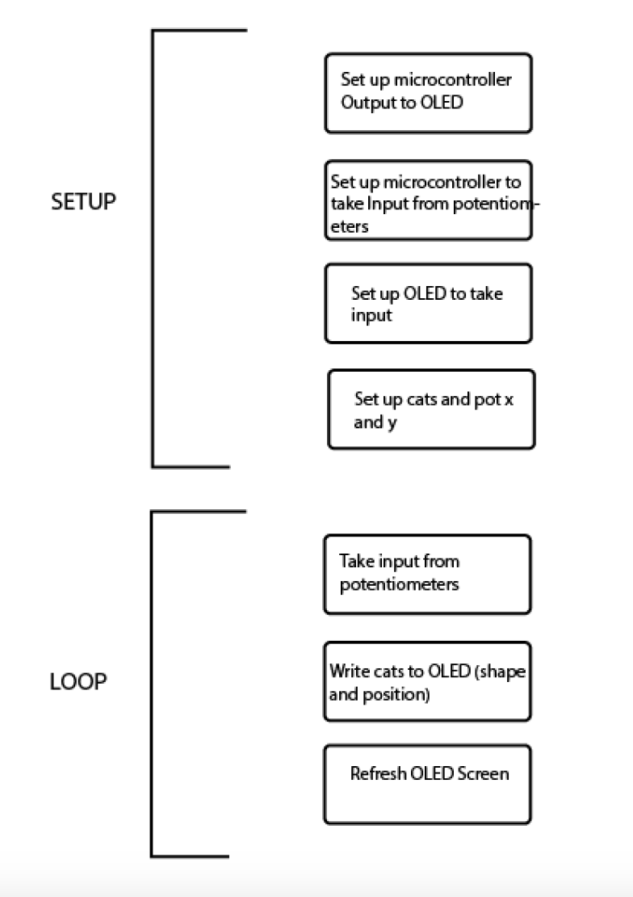
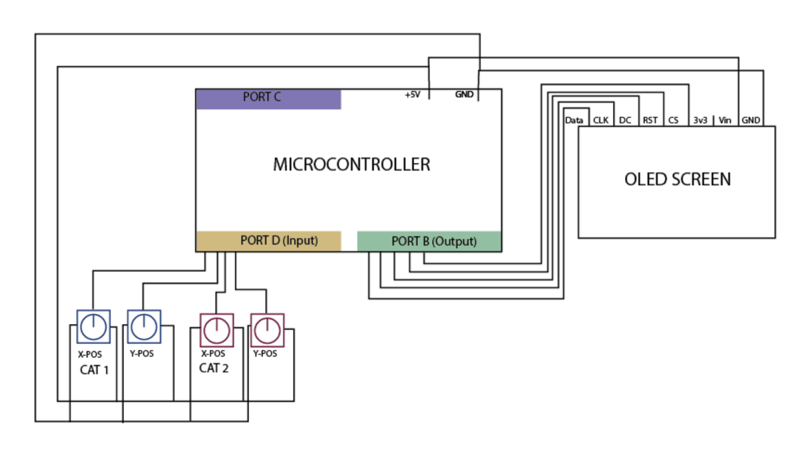

Elizabeth Grzyb

Cat Party

Final Project - CSC 330: Organization of Computer Systems

## Description:
For my final project, I want to have two cats on the screen. The position of each cat on the screen will be controlled by two potentiometers: one for the x direction and one for the y direction. In total, there will be four potentiometers - two for each cat. The whole game is that two people can control the cats on the screen and make them move around. I'm also considering adding a switch that flips the screen into "Cat party mode" where the cats start spinning around and rapidly flying around the screen themselves.

## Code Organization
Here's a brief flowchart of how I plan to write the code for this cat game:


Here is some pseudo-code outlining the Cat Party game:

```
;-------Presetup------

- .org's and .cseg will go here

- definitions of registers

- define set pointer macro

;-------Setup-----------

setup:

  - Initialize the oled screen
  - Setup port D to take input from potentiometers
  - Determine what the pot inputs will mean (x and y pos)
  - Refresh the OLED screens
  - Set array to draw cat shapes

;-------Loop------------

loop:

    - Output the x and y position of cats from
      the potentiometers.
    - Take the information in array to use to draw cats
    - Actually draw the cats to the screen
    - Refresh the screen
    - Cat party!

;------Libraries--------

-include the libraries needed for the code
```

## Hardware Organization

Here is how the hardware is set up for the Cat Party game:
